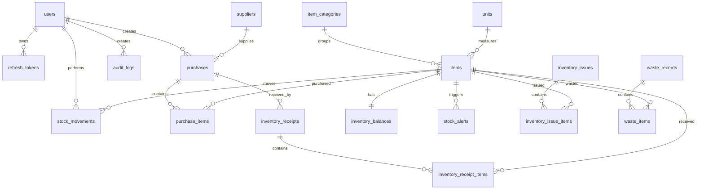

# Architecture

## Context

ATA PIMS mengganti proses manual purchase dan inventory dengan sistem terintegrasi. PostgreSQL menjadi sumber data utama. Tidak ada mock data pada runtime aplikasi.

## Backend

```text
app/
  api/v1/routes       HTTP endpoint dan OpenAPI metadata
  core                config, security, exception, RBAC
  domain              enum dan SQLAlchemy model
  schemas             Pydantic validation request/response
  services            business rules purchase, stock, waste, reports, backup
  db                  engine, session, metadata
```

## Frontend

```text
app/                  Next.js App Router pages
components/ui         Shadcn-style primitives
components/layout     authenticated app shell
features/auth         JWT auth provider
lib                   API client, shared types, formatting
```

## ERD



## Stock Rules

- Semua perubahan stok wajib membuat `stock_movements`.
- `inventory_balances` adalah cache saldo untuk dashboard dan list inventory.
- Barang keluar dan waste ditolak jika stok tidak cukup.
- Barang masuk memperbarui `average_cost` dengan weighted average.
- Stock alert aktif dibuat ketika stok `<= minimum_stock` atau `<= 0`.

## RBAC

- Owner: akses penuh, dashboard owner, laporan, export, backup.
- Purchase: input purchase, supplier, master barang, melihat inventory.
- Gudang: barang masuk, barang keluar, waste, melihat inventory dan purchase.

